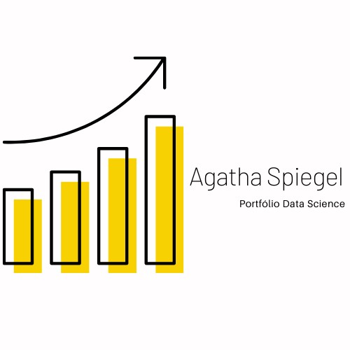

  

                      
# Oi, tudo bem?

Meu nome é Agatha e aqui vou contar um pouquinho mais sobre mim! 

Sou formada em Biblioteconomia pela Universidade Federal do Rio Grande (FURG) e possuo experiência de aproximadamente 10 anos na gestão da informação. Atualmente, trabalho em projetos relacionados a ontologia para a padronização de dados visando o controle de sinônimos, relacionamento (taxonomia) e conceitos. Em 2021 resolvi sair da zona de conforto e estudar cada vez mais sobre Data Science, dessa forma, comecei a desenvolver os meus conhecimentos em Python, Estatística, Numpy, Pandas, Seaborn, Matplotlib, Jupyter, Tableau e SQL. Os planos agora **são alinhar as minhas habilidades na gestão da informação com a análise de dados** e conseguir uma oportunidade para migrar de área! 💪

**Background in:** Indexação, classificação, taxonomia e criação de relatórios analíticos.

**Link:**
* [LinkedIn](https://www.linkedin.com/in/agathaspiegel/)
